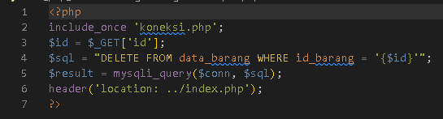

	PEMROGRAMAN WEB

	TUGAS PRATIKUM 9

	Dosen Pengampu : Agung Nugroho, M.Kom

 
	<b>Tugas untuk memenuhi syarat penilain pada Pert-11</b>

	

                 Nama  : Jose Fisto

                 NIM   : 312010119

                 Kelas : TI.20 A.1

 
 

	<b>UNIVERSITAS PELITA BANGSA</b>

	<b>FAKULTAS TEKNIK</b>

	<b>TEKNIK INFORMATIKA</b>

	<b>TA 2021 / 2022</b>

  

  

# Laporan Praktikum 9

## 1. Buat File header.php

Code header.php : 

	

## 2. Buat File footer.php

Code footer.php : 

	

## 3. Buat File home.php

Code home.php : 

	

## 4. Buat File about.php

Code about.php : 

	

Hasil output :

Hal Home :

	

Hal About :

	

## Pertanyaan dan Tugas

Implementasikan konsep modularisasi pada kode program **praktikum8** tentang
database, sehingga setiap halamannya memiliki template tampilan yang sama.

Jawaban : 

Struktur pembuatan akan di bagi menjadi 3 bagian dan ada sub-file berfungsi memanggil beberapa direktori

Struktur :

	

	

## Config (CFG)
file yang berada dalam folder cfg berfungsi untuk menyimpan dan mengeksekusikan file tersebut

code koneksi.php :

	

code tambah.php :

	

code ubah.php :

	

code hapus.php :

	

## Folder Layouts

Folder yang berisikan file berfungsi menampilkan tampilan pada halaman

code header.php :

	

code head-static.php :

	

code main.php :

	

code footer.php :

	

code tambah.php :

	

code ubah.php :

	

# Folder Static

File berada dalam folder static berfungsi untuk mendesain web (mempercantik halaman)

code style.css :

	

Output / Hasil :

Home :

	

Tambah barang :

	

Ubah :

	

	

